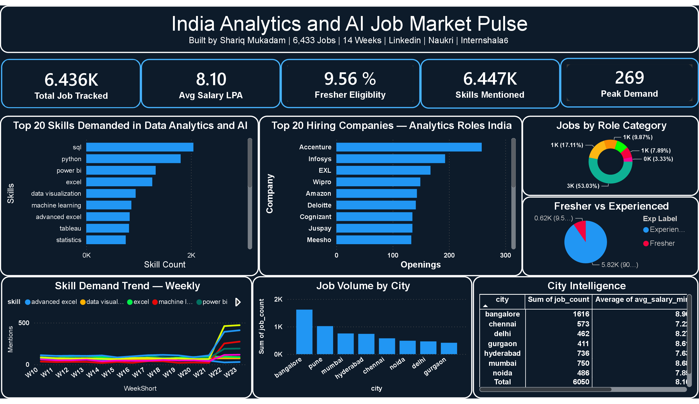

# ⚡ India Analytics & AI Job Market Pulse

> **Real-time, enterprise-grade analytics dashboard tracking Data Science, Analytics & AI job demand across India's top tech hubs — updated every week automatically.**

🔗 **[Live Dashboard →](https://jobmarketpulse.streamlit.app)** &nbsp;|&nbsp; Built by **Shariq Mukadam** &nbsp;|&nbsp; Data: Naukri · LinkedIn · Internshala

---

## 📸 Dashboard Screenshots

### Streamlit Live Dashboard — Dark UI
> _Replace with screenshot of your KPI + Skills Intel view_

### Power BI Report — DashBoard: 


---

## 🎯 What This Tracks

| Metric | Details |
|--------|---------|
| **Skill Demand** | Top 25 skills demanded across DA/BA/DE/DS/AI roles — live counts updated weekly |
| **BI Tool Battle** | Week-over-week demand velocity: Power BI vs Tableau vs Looker |
| **Geographic Matrix** | City-wise job volume, floor salaries (LPA), and fresher ingress ratios |
| **Role Split** | DA vs BA vs Data Engineer vs Data Scientist vs AI Engineer demand breakdown |
| **Platform Breakdown** | Sourcing volume by Naukri, LinkedIn, and Internshala |
| **Salary Distribution** | Box plots showing true salary spreads per city — filters extreme outliers |
| **Experience Landscape** | What % of roles are genuinely fresher-eligible vs mid/senior |
| **Company Intelligence** | Top 15 companies hiring analytics talent in India right now |

---

## 🔑 Key Findings (Updated Weekly)

- **SQL** appears in ~90% of all DA job postings — the non-negotiable core skill
- **Power BI** consistently outpaces Tableau by ~2x in the Indian market
- Only **~18%** of posted roles are genuinely fresher-eligible
- **Bangalore** leads total job volume; **Mumbai** commands the highest average starting salary
- **AI/LLM** skills are rapidly transitioning from "nice-to-have" to baseline requirements in standard analyst roles

---

## 🏗 Architecture Pipeline

```
Job Portals (Naukri · LinkedIn · Internshala)
            ↓
     scraper/main.py
[Selenium + requests + BS4]
[Anti-bot: UA rotation, random delays]
            ↓
     scraper/cleaner.py
[Pandas — normalize cities, extract 50+ skills, parse salary/exp]
[SQLite — jobs + 4 weekly aggregation tables]
[Excel — JobHarvestor.xlsx with skill frequency]
            ↓
     scraper/main2.py          (Day 2)
[JD scraping — LinkedIn API + Selenium Naukri]
[Groq LLM — llama-3.1-8b-instant skill/exp/salary extraction]
            ↓
     ┌──────────────────┬────────────────────────┐
     ↓                  ↓                        ↓
 dashboard/app.py    analysis/eda.py    powerbi/export_for_powerbi.py
[Streamlit Cloud]   [12 EDA charts]    [Excel → Power BI DashBoard report]
[Dark neon UI]      [PNG charts]
```

**Automated weekly via `scheduler.py` — pipeline executes every Monday at 9:00 AM.**

---

## 📁 Project Structure

```
india-job-market-pulse/
├── scraper/
│   ├── config.py                    # Roles, platforms, locations, API keys
│   ├── main.py                      # Day 1 — scrape all 3 platforms
│   ├── main2.py                     # Day 2 — JD scraping + Groq LLM extraction
│   ├── cleaner.py                   # Clean + load DB + save Excel
│   ├── scheduler.py                 # Weekly automation (every Monday 9am)
│   ├── scrapers/
│   │   ├── internshala.py           # requests + BS4
│   │   ├── linkedin.py              # LinkedIn guest jobs API
│   │   ├── naukri.py                # Selenium + fallback
│   │   └── jd_scraper.py            # Full JD text scraping (Day 2)
│   └── utils/
│       ├── driver.py                # undetected-chromedriver setup
│       ├── humanize.py              # Human-like scroll/delay behavior
│       └── extractor.py             # Groq LLM JSON extraction
├── data/
│   ├── job_market.db                # SQLite — 5 tables, time-series design
│   ├── jobs_raw.csv                 # Raw scraped output
│   └── JobHarvestor.xlsx            # Styled Excel — All Jobs + Skill Frequency
├── analysis/
│   ├── eda.py                       # 12 EDA charts — cell-blocked for VS Code
│   └── charts/                      # Saved PNG charts
├── dashboard/
│   └── app.py                       # Streamlit dashboard (dark neon UI + Plotly)
├── powerbi/
│   ├── export_for_powerbi.py        # Exports DB → Excel for Power BI
│   ├── india_job_market_powerbi.xlsx # 6-sheet Excel (auto-generated)
│   ├── POWERBI_GUIDE.md             # Step-by-step Dashboard report build guide
│   └── screenshots/                 # Power BI report screenshot
├── deploy/
│   └── streamlit_deploy.md          # Streamlit Cloud deploy guide
├── .env                             # GROQ_API_KEY (not committed)
└── requirements.txt
```

---

## 🚀 Quick Start

```bash
git clone https://github.com/YOUR_USERNAME/india-job-market-pulse.git
cd india-job-market-pulse
pip install -r requirements.txt

# Day 1 — Scrape + clean + load DB + generate Excel
cd scraper
python main.py                    # all 3 platforms
python main.py --skip-naukri      # skip Naukri if Brave not installed

# Launch dashboard
streamlit run ../dashboard/app.py

# Generate EDA charts
cd ../analysis && python eda.py

# Day 2 — JD scraping + Groq LLM enrichment
# (add GROQ_API_KEY to .env first — free at console.groq.com)
cd ../scraper && python main2.py

# Export for Power BI
python ../powerbi/export_for_powerbi.py
```

---

## 🛠 Tech Stack

| Layer | Tools |
|-------|-------|
| **Scraping** | Python, Selenium, undetected-chromedriver, requests, BeautifulSoup |
| **Data Engineering** | Pandas, Regex (50+ skill patterns), SQLite3 |
| **LLM Extraction** | Groq API — llama-3.1-8b-instant (3-key rotation) |
| **Dashboard UI** | Streamlit, Custom CSS (dark neon), Plotly Graph Objects |
| **EDA / Charts** | Matplotlib, Seaborn, WordCloud |
| **BI Reporting** | Power BI Desktop — Dashboard report |
| **Deployment** | Streamlit Cloud (free public URL) |

---

## 💡 Technical Highlights

- **Custom dark UI** — extensive CSS overrides bypassing default Streamlit styling, achieving a neon-on-purple aesthetic not available via standard theming
- **3-key Groq rotation** — cycles across 3 API keys to triple throughput (~90 req/min) during LLM enrichment of 1700+ job descriptions
- **Anti-bot scraping** — user-agent rotation, randomized 2.5–4.5s delays, non-headless fallback, junk-role filtering
- **Advanced skill extraction** — Regex engine matches 50+ data-stack patterns, prioritizing multi-word phrases first to prevent false-positive partial matches
- **Incremental design** — DB dedupes on `(job_url, scrape_date)`, safe to re-run indefinitely without data corruption
- **Pre-aggregated tables** — 4 weekly rollup tables for instant dashboard queries, no heavy SQL at render time

---

*Built to solve my own problem — instead of guessing what skills to learn, I measured the actual market.*